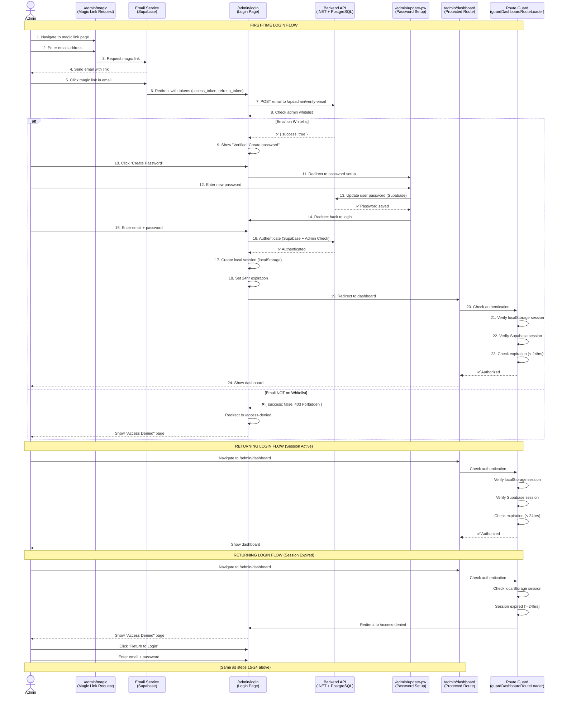

# 🔐 Authentication Flow Documentation
## Food for the World - Pantry Management System

> **Last Updated:** February 2, 2026
> **Purpose:** Comprehensive guide to the authentication system for client reference and developer onboarding

---

## 📋 Table of Contents
1. [Overview](#overview)
2. [User Journey](#user-journey)
3. [Authentication Routes](#authentication-routes)
4. [Flow Diagrams](#flow-diagrams)
5. [Technical Implementation](#technical-implementation)
6. [Security Features](#security-features)
7. [Maintenance Mode](#maintenance-mode)
8. [Troubleshooting](#troubleshooting)

---

## 🎯 Overview

### What is This System?
The Food for the World application uses a **secure, email-based authentication system** to protect the pantry management dashboard. Only authorized administrators can access recipient data, check-in functionality, and reporting tools.

### Why Email-Based Authentication?
- **Passwordless initial access:** Admin users receive a secure "magic link" via email
- **One-time password setup:** After first login, users create a permanent password
- **No password reset hassles:** Users can request new magic links anytime
- **Admin whitelist:** Backend verifies email against approved admin list

### Key Features
✅ Passwordless magic link authentication
✅ Secure admin whitelist verification
✅ Automatic 24-hour session expiration
✅ Dual-layer security (browser + server)
✅ Protected dashboard routes
✅ Graceful access denial for unauthorized users

---

## 👤 User Journey

### First-Time Admin Login (Complete Flow)

#### **Step 1: Request Magic Link**
📍 **URL:** `/admin/magic`

**What Happens:**
1. Admin visits the magic link request page
2. Enters their email address (must be on whitelist)
3. Clicks "Send Magic Link"
4. System sends email with secure authentication link

**User Experience:**
- "Check your email! We've sent you a login link."
- Email arrives within 1-2 minutes
- Link is valid for a limited time

---

#### **Step 2: Click Magic Link (Email Verification)**
📍 **Email → System Verification**

**What Happens:**
1. Admin clicks link in email
2. Browser redirects to `/admin/login` with authentication tokens in URL
3. System verifies:
   - ✅ Link is not expired
   - ✅ Email is on admin whitelist (from backend `.env`)
   - ✅ Supabase session is valid

**Behind the Scenes:**
- Backend checks email against `VITE_ADMIN_EMAILS` environment variable
- Returns `{ success: true }` if admin is authorized
- Returns `403 Forbidden` if email is not on whitelist

---

#### **Step 3: First Login (One-Time Password Setup)**
📍 **URL:** `/admin/login` (auto-redirected after magic link verification)

**What Happens:**
1. Admin sees login screen with success message
2. System prompts: "Set up your password"
3. Admin clicks "Create Password" link
4. Redirected to `/admin/update-pw` (password creation page)

**User Experience:**
- "Your email has been verified! Please create a password."
- Password requirements displayed (min 8 characters, etc.)

---

#### **Step 4: Create Password**
📍 **URL:** `/admin/update-pw`

**What Happens:**
1. Admin enters new password (twice for confirmation)
2. Clicks "Create Password"
3. System:
   - ✅ Validates password strength
   - ✅ Updates Supabase user account
   - ✅ Redirects back to login page

**User Experience:**
- "Password created successfully!"
- "You can now log in with your email and password."

---

#### **Step 5: Login with Password**
📍 **URL:** `/admin/login`

**What Happens:**
1. Admin enters email + password
2. Clicks "Sign In"
3. System:
   - ✅ Authenticates with Supabase
   - ✅ Verifies admin whitelist (backend check)
   - ✅ Creates local session (`fftwSession` in localStorage)
   - ✅ Sets 24-hour expiration
   - ✅ Redirects to `/admin/dashboard`

**User Experience:**
- Smooth redirect to dashboard
- No additional prompts or setup

---

#### **Step 6: Access Dashboard**
📍 **URL:** `/admin/dashboard`

**What Happens:**
1. System checks authentication:
   - ✅ Local session exists in `localStorage`
   - ✅ Local session not expired (< 24 hours old)
   - ✅ Supabase session is valid
   - ✅ Both checks must pass
2. Dashboard loads with full functionality

**User Experience:**
- Full access to:
  - Recipient registration
  - Check-in (QR + manual)
  - Data tables (view/edit/delete)
  - QR code generator
  - Running totals dashboard
  - Monthly statistics

---

### Returning Admin Login (Simplified Flow)

**If Session is Active (< 24 hours):**
1. Admin visits `/admin/dashboard`
2. System checks local session
3. Dashboard loads immediately ✅

**If Session Expired (> 24 hours):**
1. Admin visits `/admin/dashboard`
2. System redirects to `/access-denied`
3. Admin clicks "Return to Login"
4. Admin enters email + password at `/admin/login`
5. System creates new 24-hour session
6. Redirects to `/admin/dashboard` ✅

**If Password Forgotten:**
1. Admin requests new magic link at `/admin/magic`
2. Follows magic link in email
3. System verifies email
4. Admin creates new password at `/admin/update-pw`
5. Admin logs in with new password ✅

---

## 🗺️ Authentication Routes

### Route Reference Table

| Route | Purpose | Protected | Description |
|-------|---------|-----------|-------------|
| `/admin/magic` | Magic Link Request | ❌ No | Page where admins enter email to receive magic link. Sends email via Supabase. |
| `/admin/login` | Login Page | ❌ No | Main login page. Handles both magic link callbacks and password-based login. |
| `/admin/update-pw` | Password Setup | ⚠️ Partial | Page for creating/updating password. Accessible after magic link verification or when logged in. |
| `/admin/dashboard` | Dashboard | ✅ Yes | **Protected route.** Full pantry management interface. Requires valid session (localStorage + Supabase). |
| `/access-denied` | Access Denied | ❌ No | Error page shown when unauthorized users try to access protected routes. |
| `/` (Home) | Public Homepage | ❌ No | Public-facing website. No authentication required. |

### Route Guards

**Dashboard Route Guard:**
- **File:** `src/router/router-composables-hooks/guardDashboardRouteLoader.ts`
- **Function:** `guardDashboardRouteLoader()`
- **Applied to:** `/admin/dashboard`
- **Checks:**
  1. ✅ Local session exists in `localStorage` (`fftwSession`)
  2. ✅ Local session is not expired (< 24 hours)
  3. ✅ Supabase session is valid
  4. ✅ Both checks must pass
- **On Failure:** Redirects to `/access-denied`

**Configured in:**
```typescript
// src/router/AppRouter.tsx (line 102)
{
  path: '/admin/dashboard',
  loader: guardDashboardRouteLoader, // 👈 Route guard
  element: <PantryDashboardPage />
}
```

---

## 📊 Flow Diagrams

### Mermaid Sequence Diagram



---

### Simplified Visual Flow

```
┌─────────────────────────────────────────────────────────────┐
│                    FIRST-TIME ADMIN SETUP                    │
└─────────────────────────────────────────────────────────────┘

┌──────────────┐      ┌──────────────┐      ┌──────────────┐
│ Magic Link   │ ───> │    Email     │ ───> │    Login     │
│   Request    │      │  Arrives     │      │   Screen     │
└──────────────┘      └──────────────┘      └──────────────┘
                                                    │
                                                    ▼
┌──────────────┐      ┌──────────────┐      ┌──────────────┐
│  Dashboard   │ <─── │  Login with  │ <─── │   Create     │
│   Access!    │      │  Password    │      │  Password    │
└──────────────┘      └──────────────┘      └──────────────┘


┌─────────────────────────────────────────────────────────────┐
│               RETURNING ADMIN (Session Active)               │
└─────────────────────────────────────────────────────────────┘

┌──────────────┐
│  Dashboard   │
│   Access!    │  <─── Direct access (session < 24hrs)
└──────────────┘


┌─────────────────────────────────────────────────────────────┐
│              RETURNING ADMIN (Session Expired)               │
└─────────────────────────────────────────────────────────────┘

┌──────────────┐      ┌──────────────┐      ┌──────────────┐
│ Access       │ ───> │    Login     │ ───> │  Dashboard   │
│  Denied      │      │   Screen     │      │   Access!    │
└──────────────┘      └──────────────┘      └──────────────┘
                          Enter email
                          + password
```

---

## 🔧 Technical Implementation

### Architecture Overview

**Frontend Stack:**
- React 19 + TypeScript
- React Router v7 (file-based routing)
- Jotai (state management)
- Supabase Client (authentication)

**Backend Stack:**
- .NET 8 Minimal API
- PostgreSQL (database)
- Supabase (auth service)

**Authentication Pattern:**
- **Magic Link:** Supabase Auth (passwordless)
- **Password Auth:** Supabase Auth (with local session)
- **Admin Verification:** Custom .NET endpoint
- **Session Management:** localStorage + Supabase session

---

### Key Files & Components

#### 1. Route Guard (`guardDashboardRouteLoader.ts`)
**Location:** `src/router/router-composables-hooks/guardDashboardRouteLoader.ts`
**Lines:** 10-36

**Purpose:** Protects dashboard route from unauthorized access

**Implementation:**
```typescript
export const guardDashboardRouteLoader = async () => {
  const result = await tryCatchHandler<boolean>({
    asyncActionCallback: async () => {
      // 1. Check local session
      const sessionRaw = window.localStorage.getItem('fftwSession');
      let localOk = false;
      if (sessionRaw) {
        const session = JSON.parse(sessionRaw);
        localOk = !!session && !isSessionExpired(session.expiresAt);
      }

      // 2. Check Supabase session
      const supabase = SupabaseContext.getClient();
      const { data: { session }, error } = await supabase.auth.getSession();
      const supabaseOk = !!session && !error;

      // 3. Must be valid in both places
      return localOk && supabaseOk;
    },
    errorContext: 'Auth guard failed',
  });

  if (!result) {
    return redirect('/access-denied');
  }
  return null;
};
```

**Key Logic:**
- ✅ Checks `fftwSession` in localStorage
- ✅ Validates session expiration (< 24 hours)
- ✅ Verifies Supabase session is active
- ✅ Both checks must pass
- ❌ Redirects to `/access-denied` if either fails

---

#### 2. Admin Verification (`ensureAuthenticatedSessionAction.ts`)
**Location:** `src/api/actions/auth/ensureAuthenticatedSessionAction.ts`
**Lines:** 17-58

**Purpose:** Verifies email is on admin whitelist (backend)

**Implementation:**
```typescript
export async function ensureAuthenticatedSessionAction(): Promise<VerifyMagicLinkResultType> {
  const { VITE_VERIFY_MAGIC_LINK_API_URL } = import.meta.env;

  const verifyMagicLinkRequest = async (): Promise<VerifyMagicLinkResultType> => {
    if (!VITE_VERIFY_MAGIC_LINK_API_URL) {
      return { success: false, message: 'API URL not configured.' };
    }

    const supabase = SupabaseContext.getClient();
    const { data: { session }, error } = await supabase.auth.getSession();

    if (error || !session?.user?.email) {
      return { success: false, message: 'No authentication session found.' };
    }

    // POST email to backend for admin verification
    const data = await kyMap.post(VITE_VERIFY_MAGIC_LINK_API_URL, {
      json: { email: session.user.email.toLowerCase() },
    }).json<VerifyMagicLinkResultType>();

    return {
      success: !!data?.success,
      message: data?.message ?? 'Admin email check failed.',
    };
  };

  const result = await tryCatchHandler<VerifyMagicLinkResultType>({
    asyncActionCallback: verifyMagicLinkRequest,
    errorContext: 'Error verifying magic link',
  });

  return result ?? {
    success: false,
    message: '403 Forbidden: You do not have permission to access this resource.',
  };
}
```

**Backend Endpoint:**
- **URL:** `POST /api/admin/verify-email`
- **Body:** `{ email: "admin@example.com" }`
- **Response:** `{ success: true }` or `{ success: false, message: "403 Forbidden" }`
- **Logic:** Checks email against `VITE_ADMIN_EMAILS` in `.env`

---

#### 3. Session Store (`UseSessionStore.ts`)
**Location:** `src/lib/stores/UseSessionStore.ts`
**Lines:** 26-73

**Purpose:** Manages local session state with localStorage persistence

**Implementation:**
```typescript
type AuthSession = {
  isLoggedIn: boolean;
  expiresAt: number;
  email?: string;
};

const sessionAtom = atomWithStorage<AuthSession | null>(
  'fftwSession',
  null,
);

export function UseSessionStore() {
  const [session, setSession] = useAtom(sessionAtom);

  // Auto-expire session on mount
  useOnMounted(() => {
    if (session && isSessionExpired(session.expiresAt)) {
      setSession(null);
    }
  });

  // Check expiration on updates
  useOnUpdated(() => {
      if (session && isSessionExpired(session.expiresAt)) {
        setSession(null);
      }
    }, [session, setSession],
  );

  // Async login
  const login = async (email: string, password: string) => {
    const result = await signinAction(email, password);

    if (result.success) {
      setSession({
        isLoggedIn: true,
        expiresAt: getSessionExpiration({ expiresAt: 24, unit: 'hours' }),
      });
    }

    return result;
  };

  // Logout
  const logout = async () => {
    await signoutAction();
    setSession(null);
  };

  return {
    isLoggedIn: !!session && !isSessionExpired(session.expiresAt),
    login,
    logout,
    setSession,
  };
}
```

**Key Features:**
- ✅ Persists to `localStorage` as `fftwSession`
- ✅ Auto-expires after 24 hours
- ✅ Auto-clears expired sessions on mount/updates
- ✅ Provides `isLoggedIn` flag for UI
- ✅ Async `login()` and `logout()` methods

---

#### 4. Login Form Logic (`LoginFormSection.tsx`)
**Location:** `src/components/pages/auth/login-form-sections/LoginFormSection.tsx`
**Lines:** 62-120

**Purpose:** Handles magic link callbacks and password-based login

**Key Logic:**
```typescript
useOnMounted(() => {
  // Check URL for auth indicators
  const hash = window.location.hash;
  const hasSupabaseTokens =
    hash.includes('access_token=') && hash.includes('refresh_token=');

  const params = new URLSearchParams(window.location.search);
  const isUpdateRedirect = params.get('from') === 'updateRecipients-pw';

  // If we have tokens, wait for Supabase to process them
  if (hasSupabaseTokens) {
    const supabase = SupabaseContext.getClient();

    // Set up auth listener for magic link processing
    const {
      data: { subscription },
    } = supabase.auth.onAuthStateChange(async (event, session) => {
      if (event === 'SIGNED_IN' && session && !hasProcessedMagicLinkRef.current) {
        hasProcessedMagicLinkRef.current = true;

        // Verify admin status
        const result = await ensureAuthenticatedSessionAction();

        if (!result.success) {
          // Not an admin, redirect
          await supabase.auth.signOut();
          navigate('/access-denied');
          return;
        }

        // Admin verified
        await supabase.auth.signOut();
        setSignedOut(true);
        setIsCheckingAuth(false);
      }
    });

    authSubscriptionRef.current = subscription;

    // Timeout after 3 seconds
    setTimeout(() => {
      if (!hasProcessedMagicLinkRef.current) {
        setIsCheckingAuth(false);
        navigate('/access-denied');
      }
    }, 3000);

    return;
  }

  // No tokens, do synchronous guard check
  setIsCheckingAuth(false);

  if (!isLoggedIn && !showPasswordUpdate && !isUpdateRedirect) {
    navigate('/access-denied');
  }
});
```

**Key Features:**
- ✅ Detects magic link tokens in URL hash
- ✅ Listens for Supabase auth state changes
- ✅ Verifies admin status via backend
- ✅ Redirects unauthorized users
- ✅ Handles timeout (3 seconds)
- ✅ Guards against unauthorized access

---

#### 5. Router Configuration (`AppRouter.tsx`)
**Location:** `src/router/AppRouter.tsx`
**Lines:** 92-150

**Route Configuration:**
```typescript
const routes: Array<RouteObject> = [
  {
    element: (
      <Fragment>
        <ScrollRestoration />
        <RootLayout />
      </Fragment>
    ),
    children: [
      // ... public routes ...

      // Protected Dashboard Route
      {
        path: '/admin/dashboard',
        element: (
          <Suspense fallback={<FWTLoadingStateComponent />}>
            <PantryDashboardPage />
          </Suspense>
        ),
        handle: { title: 'Food Bank Table', withLayout: true },
        // TODO: 🚨COMMENT OUT EFFECT TO RUN UI MAINTENANCE
        loader: guardDashboardRouteLoader, // 👈 Route guard
      },
    ],
  },

  // Auth Routes (no layout)
  {
    path: '/admin/magic',
    element: (
      <Suspense fallback={<FWTLoadingStateComponent />}>
        <MagicLinkDialogPage />
      </Suspense>
    ),
    handle: { title: 'Magic Link Modal', withLayout: false },
  },
  {
    path: '/admin/login',
    element: (
      <Suspense fallback={<FWTLoadingStateComponent />}>
        <LoginFormPage />
      </Suspense>
    ),
    handle: { title: 'LOGIN MODAL TEST', withLayout: false },
  },
  {
    path: '/admin/update-pw',
    element: (
      <Suspense fallback={<FWTLoadingStateComponent />}>
        <UpdatePasswordPage />
      </Suspense>
    ),
  },
  {
    path: '/access-denied',
    element: (
      <Suspense fallback={<FWTLoadingStateComponent />}>
        <AccessDeniedPage />
      </Suspense>
    ),
    handle: { title: 'Access Denied', withLayout: false },
  },
];
```

---

### Environment Variables

**Required in `.env`:**
```bash
# Supabase Auth
VITE_SUPABASE_URL=https://your-project.supabase.co
VITE_SUPABASE_ANON_KEY=your-anon-key

# Backend API
VITE_BACKEND_API_URL=http://localhost:5005

# Admin Verification Endpoint
VITE_VERIFY_MAGIC_LINK_API_URL=http://localhost:5005/api/admin/verify-email

# Admin Whitelist (backend .env)
ADMIN_EMAILS=admin1@example.com,admin2@example.com
```

---

## 🔒 Security Features

### 1. Dual Verification System
**What it does:**
Requires BOTH local session (localStorage) AND server-side session (Supabase) to be valid.

**Why it matters:**
- Prevents unauthorized access if only one layer is compromised
- Local session can be cleared (logout), but Supabase session remains (server-side)
- Both must be valid and not expired

**Implementation:**
```typescript
// guardDashboardRouteLoader.ts (lines 13-27)
const localOk = !!session && !isSessionExpired(session.expiresAt);
const supabaseOk = !!session && !error;
return localOk && supabaseOk; // Both must be true
```

---

### 2. Admin Whitelist Verification
**What it does:**
Backend checks email against approved admin list before allowing access.

**Why it matters:**
- Prevents unauthorized Supabase users from accessing dashboard
- Centralized control (backend `.env` file)
- Easy to add/remove admins

**Backend Logic (.NET):**
```csharp
// Backend API endpoint
[HttpPost("/api/admin/verify-email")]
public IActionResult VerifyEmail([FromBody] EmailRequest request)
{
    var adminEmails = Environment.GetEnvironmentVariable("ADMIN_EMAILS")
        .Split(',')
        .Select(e => e.Trim().ToLower())
        .ToList();

    if (adminEmails.Contains(request.Email.ToLower()))
    {
        return Ok(new { success = true });
    }

    return StatusCode(403, new {
        success = false,
        message = "403 Forbidden: You do not have permission to access this resource."
    });
}
```

---

### 3. Automatic Session Expiration
**What it does:**
Sessions automatically expire after 24 hours and are cleared on mount/updates.

**Why it matters:**
- Prevents indefinite access from unattended browsers
- Forces re-authentication after time limit
- Auto-clears stale sessions

**Implementation:**
```typescript
// UseSessionStore.ts (lines 30-34)
useOnMounted(() => {
  if (session && isSessionExpired(session.expiresAt)) {
    setSession(null); // Clear expired session
  }
});

// Session expiration check
export function isSessionExpired(expiresAt: number): boolean {
  return Date.now() > expiresAt;
}

// Session creation (24 hours)
expiresAt: getSessionExpiration({ expiresAt: 24, unit: 'hours' })
```

---

### 4. Proper Redirect Flow
**What it does:**
Unauthorized users are gracefully redirected to `/access-denied` page.

**Why it matters:**
- No confusing errors or blank pages
- Clear messaging ("You don't have permission")
- Easy path back to login

**Implementation:**
```typescript
// guardDashboardRouteLoader.ts (lines 32-35)
if (!result) {
  return redirect('/access-denied');
}
return null;
```

---

### 5. Type-Safe Error Handling
**What it does:**
All authentication actions return typed results with success flags.

**Why it matters:**
- Prevents runtime errors
- Clear error messaging
- Easy to debug

**Type Definition:**
```typescript
export type ApiActionResult<T> = {
  success: boolean;
  message?: string;
  data?: T;
  error?: Error;
};
```

---

## 🛠️ Maintenance Mode

### What is Maintenance Mode?
**Purpose:** Allows developers to work on the dashboard UI without authentication guards blocking access.

**Use Cases:**
- UI development and testing
- Component styling and layout
- Data table debugging
- Non-production environments

---

### How to Enable Maintenance Mode

#### **Step 1: Comment Out Route Guard**
**File:** `src/router/AppRouter.tsx`
**Lines:** 13-15, 102

**Before (Auth Enabled):**
```typescript
import { guardDashboardRouteLoader } from './router-composables-hooks/guardDashboardRouteLoader.ts';

// ...

{
  path: '/admin/dashboard',
  loader: guardDashboardRouteLoader, // 👈 Guard is active
  element: <PantryDashboardPage />
}
```

**After (Maintenance Mode):**
```typescript
// import { guardDashboardRouteLoader } from './router-composables-hooks/guardDashboardRouteLoader.ts';

// ...

{
  path: '/admin/dashboard',
  /*loader: guardDashboardRouteLoader,*/ // 👈 Guard is commented out
  element: <PantryDashboardPage />
}
```

---

#### **Step 2: Comment Out Login Form Guard**
**File:** `src/components/pages/auth/login-form-sections/LoginFormSection.tsx`
**Lines:** 60, 116-119

**Before (Auth Enabled):**
```typescript
// TODO: 🚨COMMENT OUT EFFECT TO RUN UI MAINTENANCE
useOnMounted(() => {
  // ... magic link processing ...

  // TODO: 🚨COMMENT OUT EFFECT TO RUN UI MAINTENANCE
  if (!isLoggedIn && !showPasswordUpdate && !isUpdateRedirect) {
    navigate('/access-denied'); // 👈 Guard is active
  }
});
```

**After (Maintenance Mode):**
```typescript
// TODO: 🚨COMMENT OUT EFFECT TO RUN UI MAINTENANCE
useOnMounted(() => {
  // ... magic link processing ...

  // TODO: 🚨COMMENT OUT EFFECT TO RUN UI MAINTENANCE
  /*
  if (!isLoggedIn && !showPasswordUpdate && !isUpdateRedirect) {
    navigate('/access-denied'); // 👈 Guard is commented out
  }
  */
});
```

---

### How to Re-Enable Authentication

**Reverse the steps above:**
1. Uncomment import in `AppRouter.tsx` (line 13-15)
2. Uncomment `loader: guardDashboardRouteLoader` (line 102)
3. Uncomment redirect logic in `LoginFormSection.tsx` (lines 116-119)

**Markers to Look For:**
- 🚨 `TODO: COMMENT OUT EFFECT TO RUN UI MAINTENANCE`
- Comment blocks around `guardDashboardRouteLoader` and `navigate('/access-denied')`

---

### ⚠️ Important Notes
- **NEVER deploy with maintenance mode enabled**
- **NEVER commit commented-out guards to production branch**
- **ALWAYS test authentication after re-enabling guards**
- Use maintenance mode only in local development or staging environments

---

## 🐛 Troubleshooting

### Common Issues & Solutions

---

#### **Issue 1: "Access Denied" After Magic Link Click**

**Symptoms:**
- Click magic link in email
- Redirected to `/access-denied` instead of login screen

**Possible Causes:**
1. Email not on admin whitelist
2. Backend verification endpoint not configured
3. Supabase session expired

**Solutions:**
1. **Check Admin Whitelist:**
   - Open backend `.env` file
   - Verify email is in `ADMIN_EMAILS` list
   - Format: `ADMIN_EMAILS=admin1@example.com,admin2@example.com`

2. **Verify Backend Endpoint:**
   - Check `VITE_VERIFY_MAGIC_LINK_API_URL` in frontend `.env`
   - Should be: `http://localhost:5005/api/admin/verify-email`
   - Test endpoint manually with Postman/curl

3. **Check Backend is Running:**
   ```bash
   curl -X POST http://localhost:5005/api/admin/verify-email \
     -H "Content-Type: application/json" \
     -d '{"email": "your-email@example.com"}'
   ```
   Expected response: `{"success": true}`

---

#### **Issue 2: Session Expires Immediately**

**Symptoms:**
- Login successful
- Redirected to dashboard
- Immediately kicked out to `/access-denied`

**Possible Causes:**
1. Session expiration logic error
2. `isSessionExpired()` function issue
3. `localStorage` not persisting

**Solutions:**
1. **Check localStorage:**
   - Open browser DevTools → Application → Local Storage
   - Look for `fftwSession` key
   - Verify `expiresAt` timestamp is in the future

2. **Verify Session Expiration Logic:**
   ```typescript
   // Should create 24-hour session
   expiresAt: Date.now() + (24 * 60 * 60 * 1000)
   ```

3. **Check Browser Console:**
   - Look for errors related to `isSessionExpired()`
   - Verify no timezone issues (uses `Date.now()` in UTC)

---

#### **Issue 3: Dashboard Loads Without Authentication**

**Symptoms:**
- Can access `/admin/dashboard` without logging in
- No redirect to login page

**Possible Causes:**
1. Route guard commented out (maintenance mode active)
2. Guard import commented out in router

**Solutions:**
1. **Check Router Configuration:**
   - Open `src/router/AppRouter.tsx`
   - Verify lines 13-15 are uncommented:
     ```typescript
     import { guardDashboardRouteLoader } from './router-composables-hooks/guardDashboardRouteLoader.ts';
     ```
   - Verify line 102 has loader uncommented:
     ```typescript
     loader: guardDashboardRouteLoader,
     ```

2. **Restart Dev Server:**
   ```bash
   pnpm run:dev
   ```

---

#### **Issue 4: Magic Link Email Not Arriving**

**Symptoms:**
- Enter email on `/admin/magic` page
- No email received after 5+ minutes

**Possible Causes:**
1. Supabase email service not configured
2. Email in spam folder
3. Wrong email address entered

**Solutions:**
1. **Check Supabase Email Settings:**
   - Open Supabase dashboard
   - Go to Authentication → Email Templates
   - Verify "Magic Link" template is enabled

2. **Check Spam Folder:**
   - Email may be filtered
   - Add Supabase sender to contacts

3. **Verify Email Address:**
   - Check for typos
   - Must match email on admin whitelist exactly

4. **Check Supabase Logs:**
   - Supabase Dashboard → Logs
   - Look for email send errors

---

#### **Issue 5: "No Authentication Session Found"**

**Symptoms:**
- Error message after clicking magic link
- Cannot proceed to password setup

**Possible Causes:**
1. Magic link expired (30 minutes)
2. Supabase session not created
3. Browser blocking cookies

**Solutions:**
1. **Request New Magic Link:**
   - Go back to `/admin/magic`
   - Re-enter email
   - Click new link within 30 minutes

2. **Check Browser Cookies:**
   - DevTools → Application → Cookies
   - Look for Supabase cookies (`.supabase.co` domain)
   - If blocked, adjust browser settings

3. **Clear Browser Cache:**
   - Clear cookies and site data
   - Request new magic link

---

#### **Issue 6: Password Reset Not Working**

**Symptoms:**
- Click "Forgot Password" on login page
- No reset email arrives

**Possible Causes:**
1. Using magic link flow instead of password reset
2. Supabase password reset not configured

**Solutions:**
1. **Use Magic Link Flow:**
   - Food for the World uses **magic links** for password reset
   - Go to `/admin/magic` instead
   - Request new magic link
   - Create new password at `/admin/update-pw`

2. **Alternative: Manual Admin Password Reset:**
   - Contact system administrator
   - Admin can reset password via Supabase dashboard
   - Supabase → Authentication → Users → [User] → Reset Password

---

### Debug Checklist

**Before Contacting Support:**
- [ ] Backend API is running (`http://localhost:5005/health-check`)
- [ ] Frontend dev server is running (`http://localhost:5173`)
- [ ] Email is on admin whitelist (backend `.env`)
- [ ] Supabase credentials configured (frontend `.env`)
- [ ] Browser cookies enabled
- [ ] No browser extensions blocking auth (try incognito)
- [ ] `localStorage` is not full (check DevTools)
- [ ] Route guards are uncommented (not in maintenance mode)
- [ ] No console errors in browser DevTools

**Logs to Check:**
1. Browser Console (`F12` → Console)
2. Network Tab (`F12` → Network)
3. Backend API logs (terminal)
4. Supabase Dashboard logs

---

## 📞 Support & Contact

**For Technical Issues:**
- Check this documentation first
- Review [Troubleshooting](#troubleshooting) section
- Contact development team

**For Admin Access Requests:**
- Email system administrator
- Provide email address to add to whitelist
- Wait for confirmation before attempting login

**For General Questions:**
- Refer to main project `README.md`
- Check `CLAUDE.md` for architecture details
- Review `SESSION.md` for recent changes

---

## 📝 Document History

| Date | Author | Changes |
|------|--------|---------|
| 2026-02-02 | Claude Sonnet 4.5 | Initial documentation created. Comprehensive auth flow with diagrams, routes, and troubleshooting. |

---

**END OF DOCUMENT**
